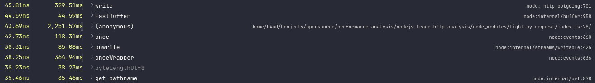

# `isTraceHTTPEnable` Performance Analysis

This repo can be used to inspect and see the performance of [isTraceHTTPEnabled](https://github.com/nodejs/node/blob/abb1c45af774ae3caaa449ddcbfe44143a98e9c7/lib/internal/http.js#L40).

## How to Use

First, install the dependencies:

```
npm i
```

This will install [light-my-request](https://github.com/fastify/light-my-request) that is used to emulate HTTP behavior without needing to create a HTTP Server.

Then, get the CPU profile:

```
npm run prof
```

This will generate a file like `CPU.[Number]...` ending with `.cpuprofile`.

## Cached Profiles

I already run some profiles, you can see below:

- [NodeJS 16.x](./nodejs-16.x.cpuprofile)
- [NodeJS 18.x](./nodejs-18.x.cpuprofile)
- [NodeJS 20.x](./nodejs-20.x.cpuprofile)

## How to Visualize?

To visualize the `isTraceHTTPEnabled`, you need to open that profile with VSCode because they have support to visualize CPU Profiles in a way that shows the amount of time spent in each function.

If you don't have VSCode and don't want to install, you can use [speedscope](https://www.speedscope.app/). Just import the CPU Profile and go to the tab `Sandwich` and import 

Below, the example images of each profile.

### NodeJS 16.x

Above, we can't find `isTraceHTTPEnabled`, probably it was introduced after 16.x.



### NodeJS 18.x


### NodeJS 20.x


